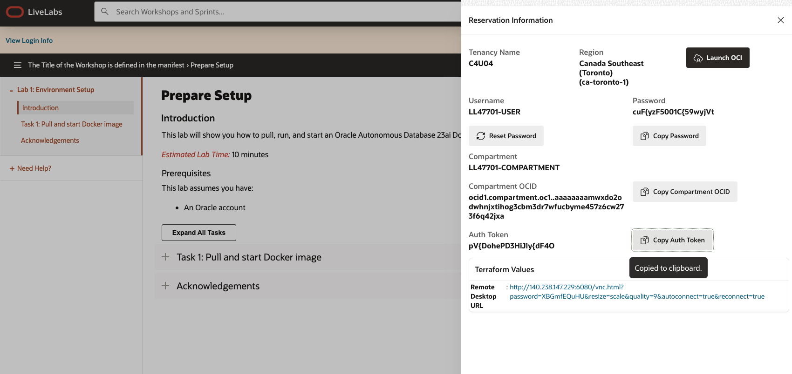
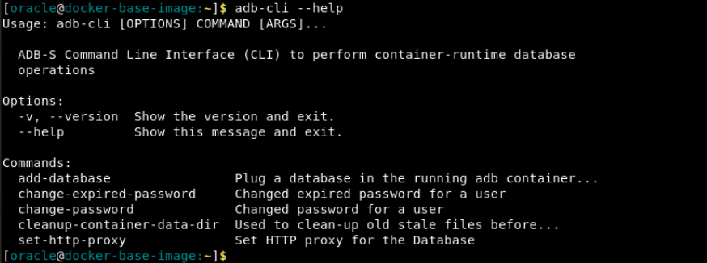
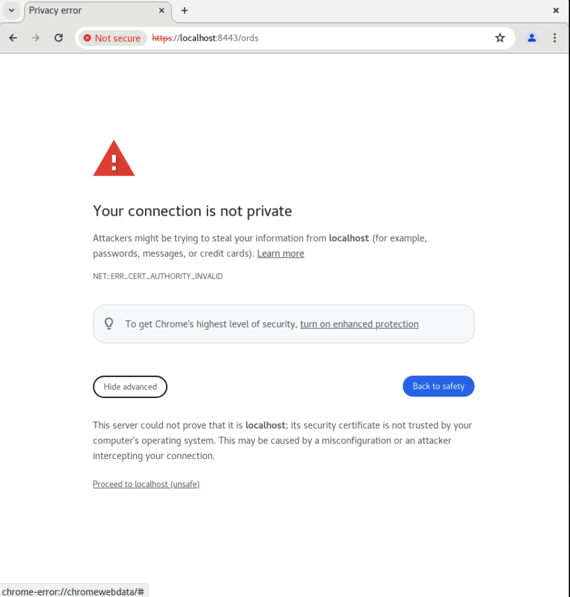
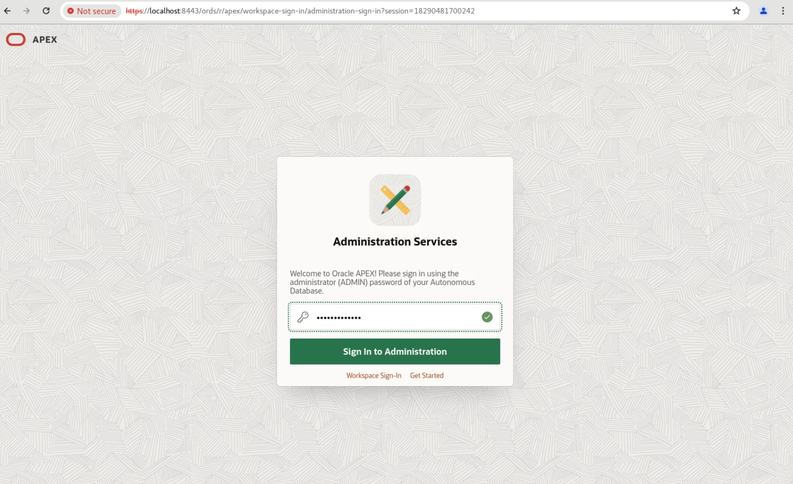

# Prepare Setup

## Introduction
This lab will show you how to pull, run, and start an Oracle Autonomous Database 23ai Docker image.

*Estimated Lab Time:* 10 minutes

### Prerequisites
This lab assumes you have:
- An Oracle account

## Task 1: Pull and start Docker image
1.  The terminal should be open, if not go to Activities and click Terminal.

    
 
2.  Pull the zip file with our podman-compose files and scripts that we'll be running to create and configure the ADB container. We'll also be unzipping the files, then giving them the permissions to be executable within the container.

    ```
    <copy>
    wget https://objectstorage.ca-toronto-1.oraclecloud.com/n/c4u04/b/apex-images/o/compose.zip
    unzip compose.zip
    chmod +x scripts start-container.sh
    chmod ugo+x -R scripts start-container.sh
    </copy>
    ```

6. Run this command to begin the process of starting up the container.

    ```
    <copy>
    ./start-container.sh
    </copy>
    ```

3. Now that you are prompted to login, type the username in the format of ***tenancy-name***/***username***. The password will be your ***auth-token***. You will find all the necessary information in the Login Details of your LiveLabs reservation. 

    

4. Hit enter, and it should say "Login Succeeded".

    

5. Once it reaches SQL Developer, paste this in to run this command within the container.

    ```
    <copy>
    @/u01/scripts/reset-image-prefix.sql
    </copy>
    ```

6. Type exit to get back into your regular host.


7. Now, the ADB container is live and you can run commands against it. You can view the list of available commands using the following command.

    ```
    <copy>
    adb-cli --help 
    </copy>
    ```

    


## Task 2: Access Database Actions and APEX

1. To access Database Actions/ORDS, open a new window in your Chrome browser and go to this website:

    ```
    <copy>
    https://localhost:8443/ords
    </copy>
    ```

    It must include the "https://" to work.

2. Click 'Advanced' then 'Proceed to localhost (unsafe)'.
    
    

3. Sign in with the password you had set as ADMIN_PASSWORD in the run command for Task 1, Step 6.

    

4. Now you have access to Database Actions and APEX within your ADB 23ai Container Image! Feel free to explore what's possible within your environment.

<!-- 11. 
9. You can add a database.

    ```
    <copy>
    adb-cli add-database --workload-type "ADW" --admin-password "Welcome_1234"
    </copy>
    ```

10. You can change the admin password.

    ```
    <copy>
    adb-cli change-password --database-name "MYADW" --old-password "Welcome_1234" --new-password "Welcome_12345"
    </copy>
    ```

11. **Note:** At anytime, you can check if your container is still running with this command. The list returned should not be empty.

    ```
    <copy>
    podman ps -a
    </copy>
    ```

 11. 
mkdir /scratch/
podman cp adb-free:/u01/app/oracle/wallets/tls_wallet /scratch/tls_wallet

12. 

hostname fqdn -->


<!-- 11. This is how you connect to ORDS.

12. Finally, this is how you would connect to APEX. -->

## Acknowledgements
* **Author** - Kaylien Phan, Senior Product Manager
* **Contributors** - David Start
* **Last Updated By/Date** - Kaylien Phan, May 2024